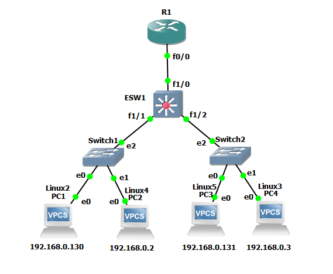
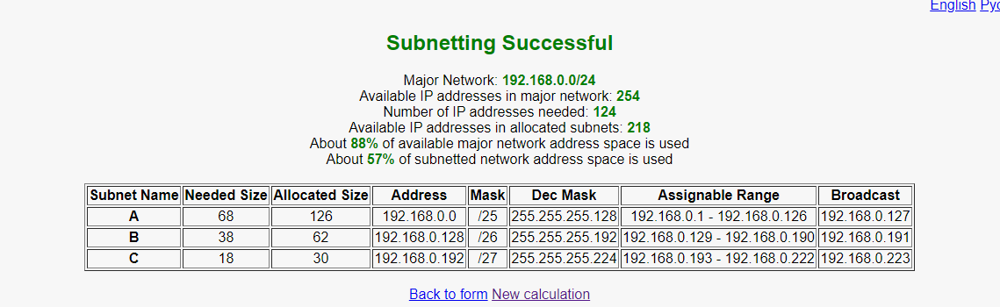

# PRACTICA 5

**INTEGRANTES**  
**Integrante 1**: Maynor David Salguero Guillén - 201504192  
**Integrante 2**: Byron David Cermeño Juarez - 201313734  
**Integrante 2**: Juan Pablo Osuna de Leon - 201503911  

**CURSO**: REDES DE COMPUTADORAS 1  

# MANUAL DE USUARIO  

Este manual esta diseñado con la finalidad de ayudar a los usuarios del proyecto, para entender el proyecto funcionando, y así mismo para poder replicar paso a paso la configuración utilizada en el proyecto.

## HERRAMIENTAS UTILIZADAS

- GNS3  
- Putty  
- VMWare  

<br>
<br>

## TOPOLOGIA 1



Se va a simular la topología de red para lo que se configura la VPN por medio de la nube, así de esta manera poder conectar las distintas topologías.

<br>
<br>

## DIRECCIONES ASIGNADAS A LAS VLANS



<br>
<br>

## CONFIGURACIÓN DE LA TOPOLOGIA

<br>
<br>

Una vez realizada la topología nos aseguramos de tener las conexiones de los switchs en modo truncal para las conexiones a los Ethernet Switch, y en modo acceso con las vlan asignadas, para las vpc y/o VM conectadas.

Se procede a configurar el EthernetSwitch con los siguientes comandos:


<br>
Para configurar el Ethernet Switch como servidor vamos a incertar los siguiente comandos:

```sh
conf t
vtp domain practica5
vtp password practica 5
vtp mode server
end
```
<br>

<br>

<h2> Puertos modo trunk en Ethernet Switch Servidor y Clientes </h2>
Vamos a realizar una configuración para los puertos utilizados en los Ethernet Switch para poder tenerlos como trunk, permitiendo la comunicación entre ellos, esto lo hacemos con los siguientes comandos en cada uno de los Ethernet Switch.

```sh
conf t
interface range f1/1 - 6
switchport mode trunk
no shut
end
```
<br>


<br>
<br>

<h2> Creacion de VLAN en Servidor </h2>
Para poder utilizar las vlans, necesitamos configurar el servidor, creando las mismas utilizando este comando:

```sh
conf t
vlan 10
name VENTAS
end
``` 
<br>

<br>
<br>

Podemos utilizar el siguiente comando para ver las VLAN implementadas

```sh
sh vlan-switch
```

<h2> Configuración del router </h2>
Ahora vamos a pasar a configurar el router, lo encendemos y en la consola procedemos a primero asignar la interfaz con los siguientes comandos:

```sh
conf t
interface fastEthernet 0/0
duplex full
speed 100
no shutdown
end
```
<br>


<br>
<br>

Luego configuramos las interfaces para las conexiones de vlan con los comandos:

```sh
conf t
int f0/0.10
encapsulation dot1q 10
ip address 192.168.12.254 255.255.255.0
end
```
<br>

Podemos utilizar el siguiente comando para ver las interfaces configuradas

```sh
sh ip interface brief
```
<br>
<h3> Verificación VLAN en Servidor </h3>


<br>
<br>
<br>
<br>

Ping PC2

<br>
<br>

Ping PC1

<br>
<br>

Ping PC3

<br>
<br>

Ping PC4

<br>
<br>

Topologia final completa

